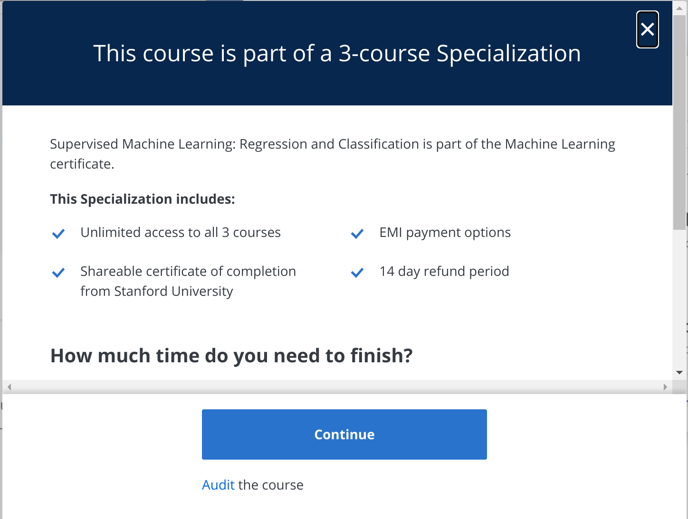

# Week 2: Linear and Logistic Regression

## Regression

Before we begin developing full-fledged neural networks, we begin by understanding one of the most fundamental machine learning techniques- regression.

In this week, you will understand the logic behind linear and logistic regression, and how we harness mathematical and computational power to solve problems.

The resources for this week will be the [**online course on Supervised Learning**](https://www.coursera.org/learn/machine-learning) on Coursera by Andrew NG. It is highly recommended that you complete all the video tutorials by the end of this week.

You do not need to enrol for the course, you can audit all the content for free.

</img>  
*Upon pressing the Enroll for Free button, you will see this popup. Click on the "Audit" hyperlink near the bottom, below the continue button*

## Assignment

Learning to implement logistic regression from scratch fosters a deeper understanding of the algorithm's mechanics, parameter optimization using gradient descent and model evaluation.

For this week's assignment, you will build a gradient descent model that predicts the chance of having Coronary Heart Disease in 10 years on [**this dataset**](https://www.kaggle.com/datasets/dileep070/heart-disease-prediction-using-logistic-regression).

Refer to [**this document**](https://docs.google.com/document/d/1Ubu08WX3zkUg6Jnzpal39DD7y3ofikX8v_9e9rAxs5k/edit?usp=sharing) as a comprehensive resource to streamline and simplify the task at hand.

You will have to submit your code in an ```.ipynb``` notebook via a Google form that we will share soon.

**Deadline: 6 Jan 2024**

**Submission link:** https://forms.gle/eU8CCm2NdU5D6Y9s6

## Neural Networks

Although we won't formally start with neural networks until next week, [**here**](https://www.youtube.com/watch?v=aircAruvnKk) is a short YouTube playlist that explains neural networks very nicely, do go through it!
